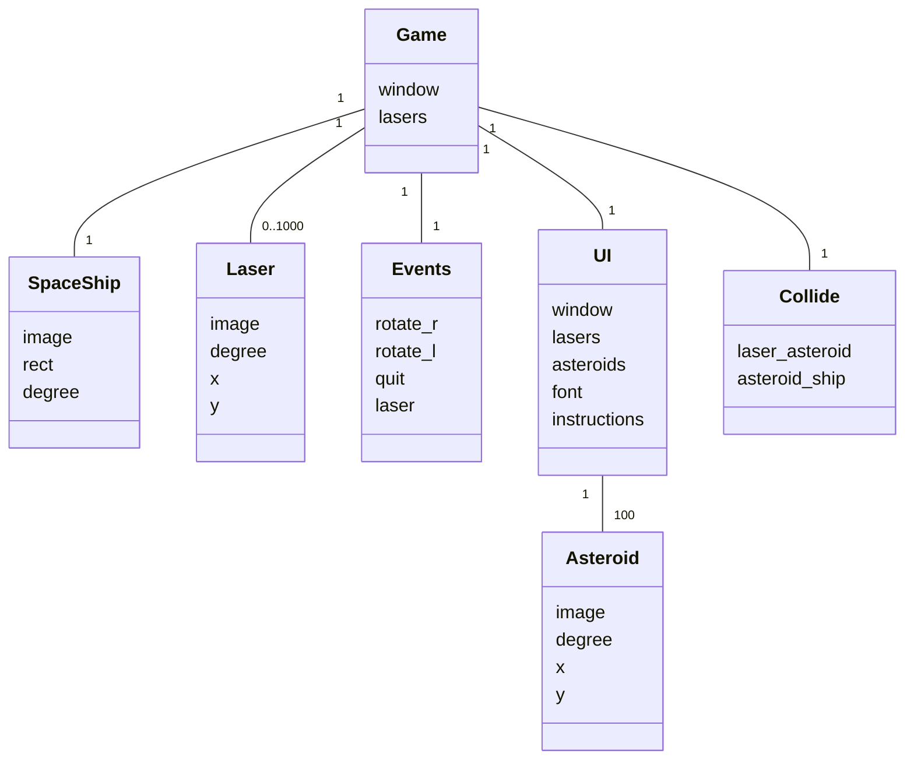

# Arkkitehtuuri

## Luokkakaavio



## Sekvenssikaavio laserin osumisesta asteroidiin

```mermaid
sequenceDiagram
    participant Game
    participant UI
    participant Collide
    participant Laser
    participant Asteroid
    Game ->> UI : "draw.window(spaceship)"
    UI ->> Laser : "laser in lasers"
    UI ->> Asteroid : "asteroid in asteroids"
    UI ->> Collide : "asteroid_hit_ship(laser, asteroid)"
    activate Collide
    Collide ->> Asteroid : "x"
    Asteroid -->> Collide : "233.11"
    Collide ->> Laser : "img.get_width()"
    Laser -->> Collide : "10"
    Collide ->> Laser : "x"
    Laser -->> Collide : "260.15"
    Collide ->> Asteroid : "img.get_width()"
    Asteroid -->> Collide : "30"
    Collide ->> Asteroid : "y"
    Asteroid -->> Collide : "62.85"
    Collide ->> Laser : "img.get_height()"
    Laser -->> Collide : "18"
    Collide ->> Laser : "y"
    Laser -->> Collide : "81.93"
    Collide ->> Asteroid : "img.get_height()"
    Asteroid -->> Collide : "20"
    Collide ->> Collide : "laser_asteroid = True"
    deactivate Collide
    Collide -->> UI : ""
    UI ->> Collide : "laser_asteroid"
    activate UI
    Collide -->> UI : "True"
    deactivate UI
    UI ->> UI : "points +=1"
    UI ->> Collide : "laser_asteroid = False"
    UI ->> UI : "asteroids.remove(asteroid)"
    UI ->> Asteroid : "new_asteroid"
    UI ->> UI : "asteroids.append(new_asteroid)"
    UI ->> UI : "lasers.remove(laser)"
    
    
    


