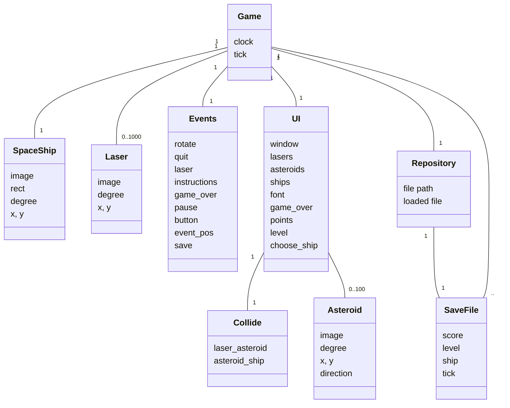
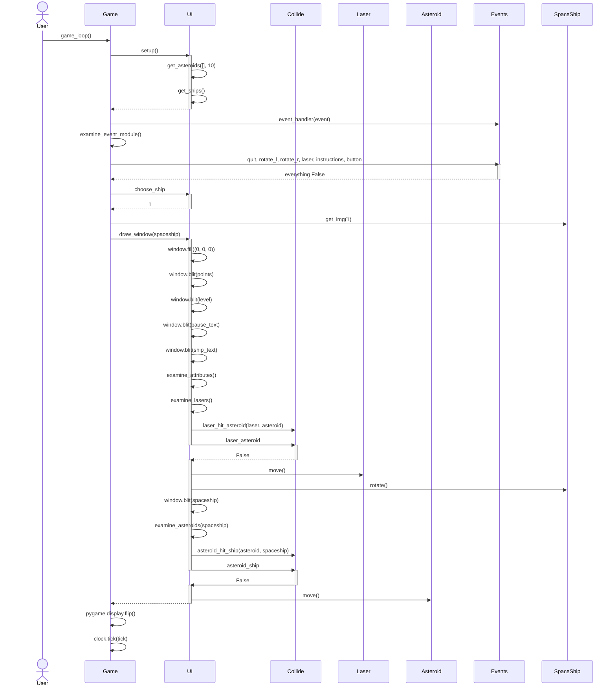

# Arkkitehtuuri

## Koodin rakenne
Pelin koodi koostuu moduuleista ja luokista eri toiminnoille. Alla oleva luokkakaavio havainnollistaa moduulien välisiä yhteyksiä. Game-moduuli pyörittää peliä, ja kutsuu tarvittaessa muita moduuleja. Spaceship, Asteroid ja Laser luokat luovat ja käsittelevät ruudulla näytettäviä kuvakkeita. Events-luokka käy läpi pelissä tapahtuvat toiminnot ja niiden perusteella moduulit Game ja UI muuttavat pelin kulkua. UI moduuli on vastuussa käyttöliittymästä. Sen kautta myös luodaan asteroidit ja tarkastetaan, onko laser osunut asteroidiin, tai asteroidi avaruusalukseen Collide-luokan avulla. Kaikkia attribuutteja ei ole joissain luokissa merkitty kaavioon selkeyden vuoksi

## Luokkakaavio


## Sekvenssikaavio pelisilmukasta
Alla sekvenssikaavio, joka näyttää pelisilmukan toiminnan yhden silmukan aikana. Kaavio on yksinkertaistettu havainnollisuuden parantamiseksi, eli funktioiden tulokset tai attribuutit on valittu niin, että silmukka olisi mahdollisimman yksinkertainen.



## Sekvenssikaavio laserin osumisesta asteroidiin
Tarkempi kuvaus oikeilla arvoilla siitä, miten peli laskee laserin osumisen asteroidiin, ja miten se toimii sen jälkeen. 

```mermaid
sequenceDiagram
    participant Game
    participant UI
    participant Collide
    participant Laser
    participant Asteroid
    Game ->> UI : draw.window(spaceship)
    UI ->> Laser : laser in lasers
    UI ->> Asteroid : asteroid in asteroids
    UI ->> Collide : asteroid_hit_ship(laser, asteroid)
    activate Collide
    Collide ->> Asteroid : x
    Asteroid -->> Collide : 233.11
    Collide ->> Laser : img.get_width()
    Laser -->> Collide : 10
    Collide ->> Laser : x
    Laser -->> Collide : 260.15
    Collide ->> Asteroid : img.get_width()
    Asteroid -->> Collide : 30
    Collide ->> Asteroid : y
    Asteroid -->> Collide : 62.85
    Collide ->> Laser : img.get_height()
    Laser -->> Collide : 18
    Collide ->> Laser : y
    Laser -->> Collide : 81.93
    Collide ->> Asteroid : img.get_height()
    Asteroid -->> Collide : 20
    Collide ->> Collide : laser_asteroid = True
    deactivate Collide
    Collide -->> UI : 
    UI ->> Collide : laser_asteroid
    activate UI
    Collide -->> UI : True
    deactivate UI
    UI ->> UI : points +=1
    UI ->> Collide : laser_asteroid = False
    UI ->> UI : asteroids.remove(asteroid)
    UI ->> Asteroid : new_asteroid
    UI ->> UI : asteroids.append(new_asteroid)
    UI ->> UI : lasers.remove(laser)
    
    
    


