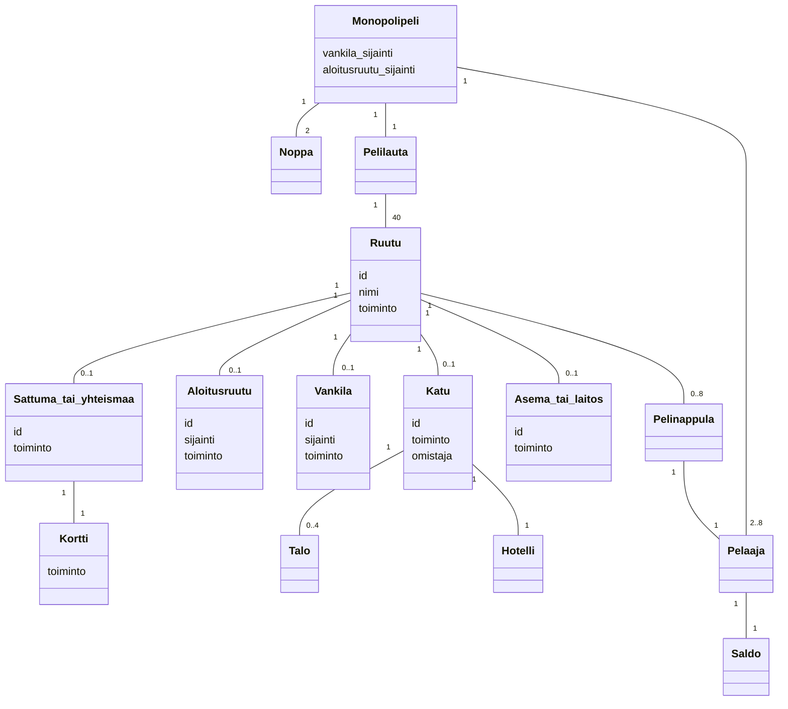

```mermaid
    classDiagram
    class Monopolipeli{
        vankila_sijainti
        aloitusruutu_sijainti
    }
    Monopolipeli "1" -- "2" Noppa
    Monopolipeli "1" -- "1" Pelilauta
    Pelilauta "1" -- "40" Ruutu
    class Ruutu{
        id
        nimi
        toiminto
    }
    Ruutu "1" -- "0..8" Pelinappula
    Ruutu "1" --"0..1" Aloitusruutu
    class Aloitusruutu{
        id
        sijainti
        toiminto
    }
    Ruutu "1" -- "0..1" Vankila
    class Vankila{
        id
        sijainti
        toiminto
    }
    Ruutu "1" -- "0..1" Sattuma_tai_yhteismaa
    class Sattuma_tai_yhteismaa{
        id
        toiminto
    }
    Sattuma_tai_yhteismaa "1" -- "1" Kortti
    class Kortti{
        toiminto
    }
    Ruutu "1" -- "0..1" Asema_tai_laitos
    class Asema_tai_laitos{
        id
        toiminto
    }
    Ruutu "1" -- "0..1" Katu
    class Katu{
        id
        toiminto
        omistaja
    }
    Katu "1" --"0..4" Talo
    Katu "1" --"1" Hotelli
    Pelinappula "1" -- "1" Pelaaja
    Pelaaja "2..8" -- "1" Monopolipeli
    Pelaaja "1" -- "1" Saldo
```
