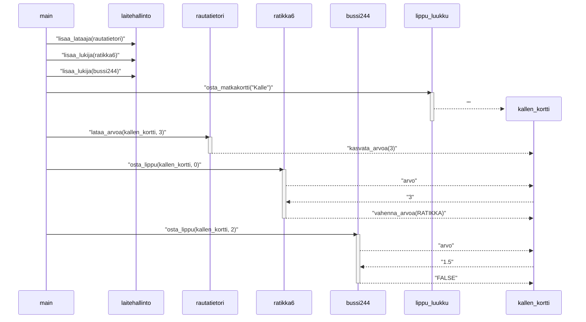

```mermaid
sequenceDiagram
  participant main
  participant laitehallinto
  participant rautatietori
  participant ratikka6
  participant bussi244
  main ->> laitehallinto : "lisaa_lataaja(rautatietori)"
  main ->> laitehallinto : "lisaa_lukija(ratikka6)"
  main ->> laitehallinto : "lisaa_lukija(bussi244)"
  main ->> lippu_luukku : "osta_matkakortti("Kalle")"
  activate lippu_luukku
  create participant kallen_kortti
  lippu_luukku -->> kallen_kortti : ""
  deactivate lippu_luukku
  main ->> rautatietori : "lataa_arvoa(kallen_kortti, 3)"
  activate rautatietori
  rautatietori -->> kallen_kortti : "kasvata_arvoa(3)"
  deactivate rautatietori
  main ->> ratikka6 : "osta_lippu(kallen_kortti, 0)"
  activate ratikka6
  ratikka6 -->> kallen_kortti : "arvo"
  kallen_kortti -->> ratikka6 : "3"
  ratikka6 -->> kallen_kortti : "vahenna_arvoa(RATIKKA)"
  deactivate ratikka6
  main ->> bussi244 : "osta_lippu(kallen_kortti, 2)"
  activate bussi244
  bussi244 -->> kallen_kortti : "arvo"
  kallen_kortti -->> bussi244 : "1.5"
  bussi244 -->> kallen_kortti : "FALSE"
  deactivate bussi244
```
  
  
